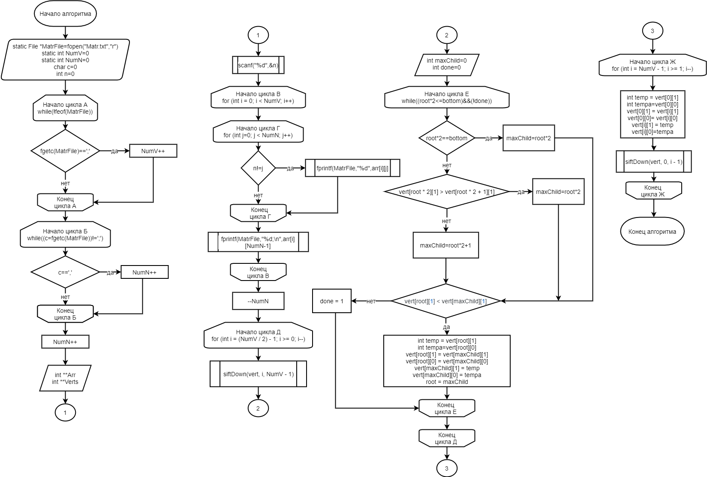

# 16.	Удалить вершины, которые смежны с заданным ребром, и отсортировать оставшиеся по возрастанию степени вершины (пирамидальная сортировка)
Граф,заданный матрицей инцидентности считывается из файла *matr.txt* в массив **arr**, через который мы будем обращаться к заданному графу.
# В программе реализованы функции:
1) Создание и компиляция файла на языке dot и вывод изображения графа на экран **seeGraph**;
2) Удаление заданного узла **delNode**;
3) Пирамидальная сортировка вершин в порядке возрастания их степеней **heapSort**;
4) Вывод вершин в порядке возрастания их степеней **printVerts**;
# Структурная схема алгоритма

